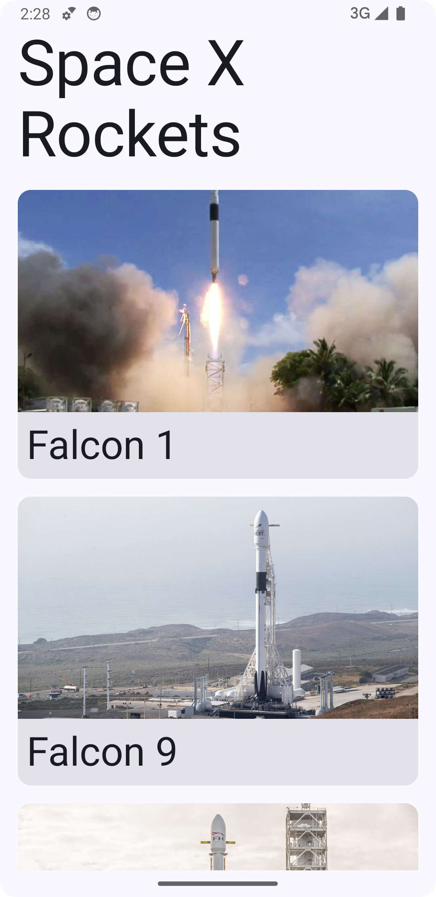

# spacex-rocket-demo

### Home

### Details

### Architecture
Modern App Architecture

Api or Cache
Repository (dependency inversion point)
Use Case (optional) not required for examples as no complex logic to encapsulate
View Model
UI

### Tools
#### Dependency Injection
hilt
#### Networking
Ktor
#### Serialization
kotlinx
#### Image download
coil

### Testing
KotlinSnapshot - using the API json as input then validate it is converted to our expected domain by recording a known good snapshot
Next steps
- load API json from files rather than kotlin consts
- create easy way to record test
- add more traditional unit tests to fill the gaps (view model logic) as required
- add screenshot tests for UI

### Other TODO
Make network loaded images work in previews
Give better information on errors to help user with the cause
Add basic large screen support
Cache rocket load so you don't need to get the details if you have already loaded the list